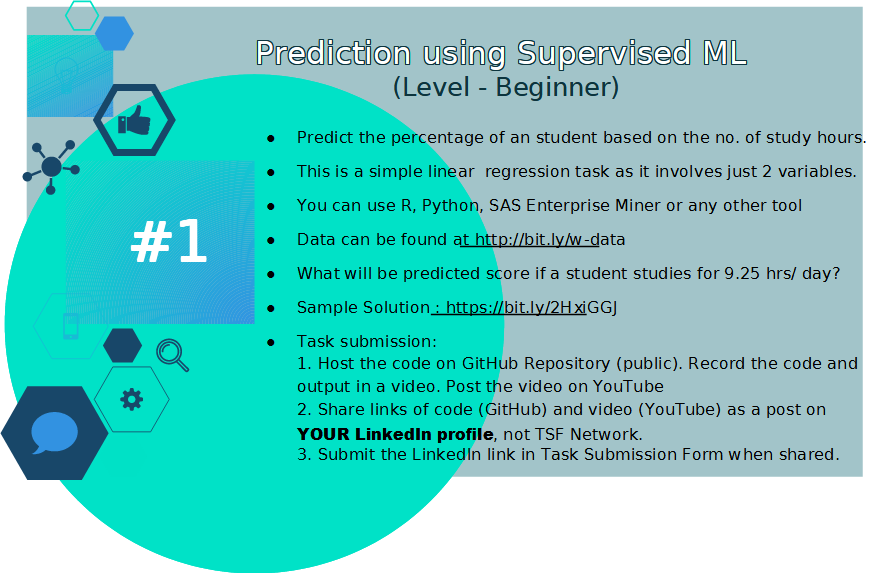
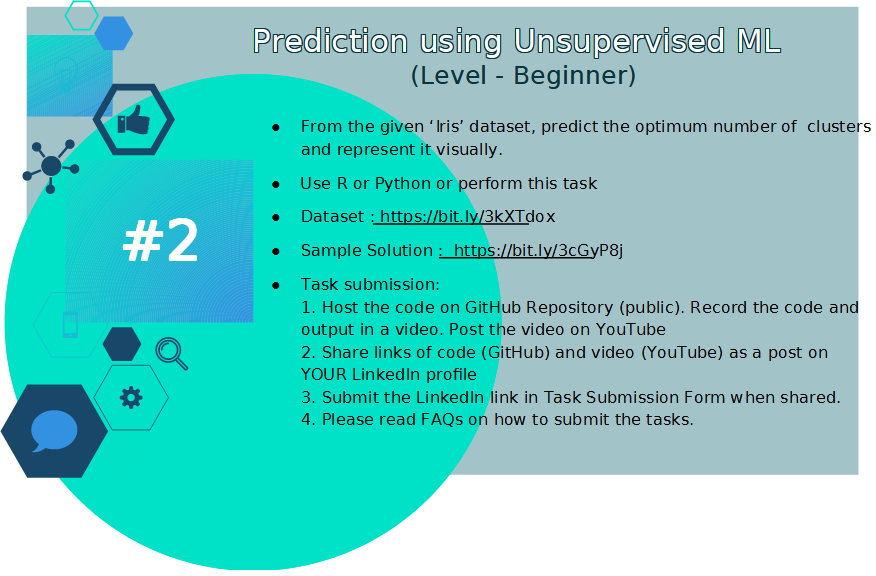
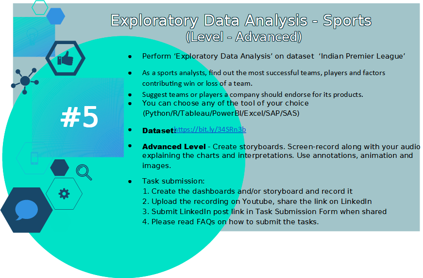
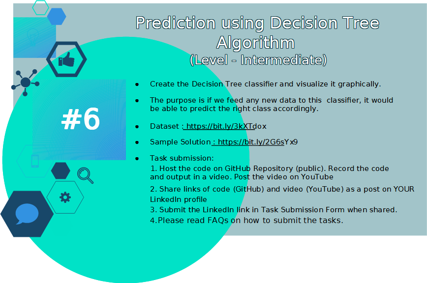

# The Sparks Foundation (TSF) 

------------

##### The Graduate Rotational Internship Program(GRIP) is a unique offer for students and recent graduates to experience and join The Sparks Foundation. In addition to skills-specific tasks, we encourage interns to build a credible professional profile.

##### This internship program is based completely online as a part-time internship for students to complete in the span of 3 months. GRIP offers internships for the areas of tech, marketing, and human resources.

## Task 1

## Task 2

## Task 3

## Task 4 

## Task 5

## Task 6

# Task 7 - In progress 🚧
